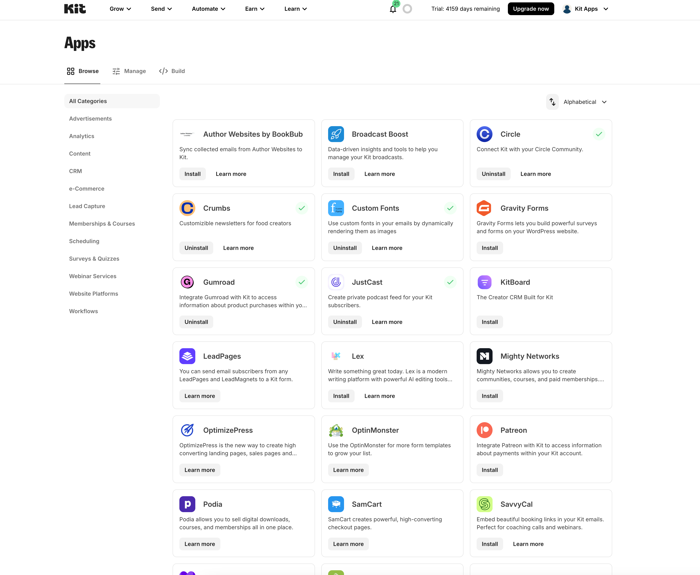

<Update label="2025-03-17" description="🚀 App Config UI">
  Today marks the release of a new and improved way to create and manage your apps - bringing app setup, authentication, plugin management and app distribution out of account settings and into its new home, in the heart Kit App Store.
<Frame>
    
  </Frame>
</Update>
<Update label="2025-03-15" description="🐛 Error codes corrected">
  lorem ipsum dolor sit amet, consectetur adipiscing elit. Donec
</Update>
<Update label="2025-02-20" description="🚀 4 new API endpoints">
  lorem ipsum dolor sit amet, consectetur adipiscing elit. Donec
</Update>